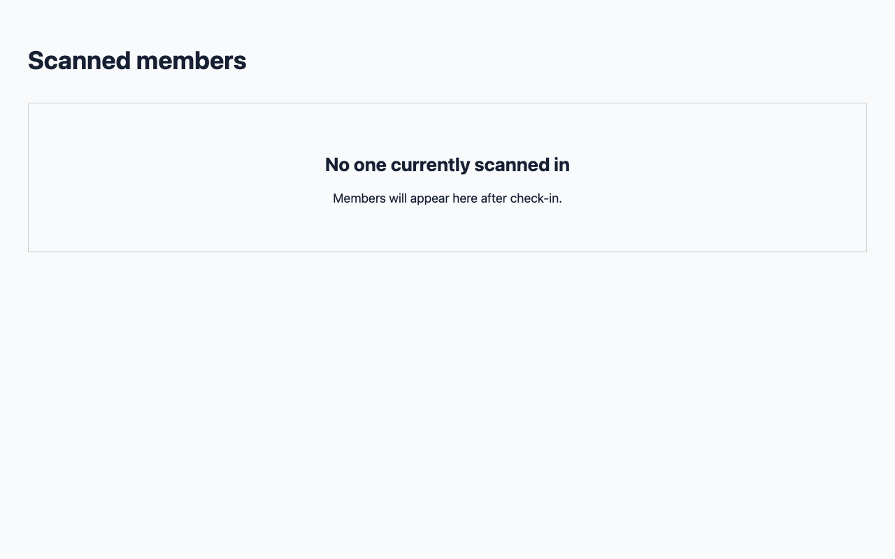
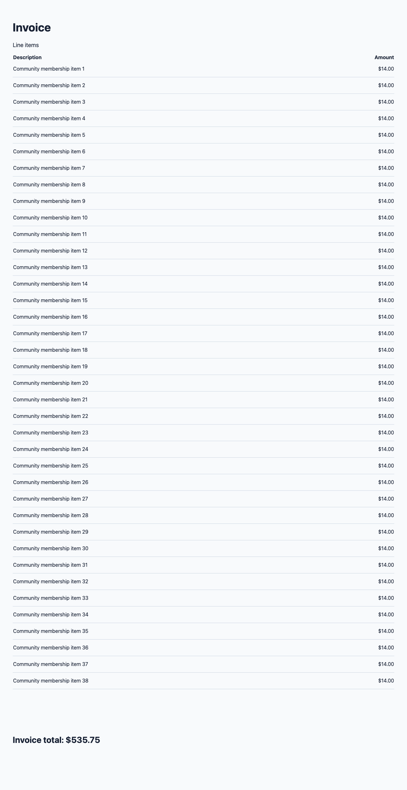

# OpenRouter claim evidence regression proof

These synthetic Chromium fixtures reproduce the failure classes reported from community-management PRs
[#5216](https://github.com/communal-hub/community-management/pull/5216) and
[#5242](https://github.com/communal-hub/community-management/pull/5242): teleported modal text, icon-only
controls, visual styling, tall pages, and claims contradicted by empty states.

Run with an OpenRouter key in the environment or the repo's gitignored `.env`:

```sh
VP_CLAIM_PROOF_DIR=docs/proof/openrouter-claims npx vitest run test/live/decisions-claims-live.test.ts
```

The test captures real PNGs, reads page text through `readDom`, and sends the prepared images and text to
`openai/gpt-6-luna-decisions-20261006`. [report.json](report.json) records the returned probabilities,
typed reasons, frame triage results, cost, and latency. [claim-check.md](claim-check.md) is the same
ready-to-paste claim markdown that normal `finish` prints.

| Evidence | Expected claim result | Recorded result |
| --- | --- | --- |
| Teleported modal warns about archiving 3 promotion codes | satisfied | 1.00 |
| Icon-only camera upload button | satisfied | 1.00 |
| Green Active badge | satisfied | 1.00 |
| Invoice total at the bottom of the tall still | satisfied | 1.00 |
| Empty scans page lists members with remove controls | not visible | 0.00; empty state contradicts the claim |
| Empty scans page shows at least one scanned member | not visible | 0.00; empty state contradicts the claim |

Frame triage calls the tall invoice and intentional empty state clean (1.00). Claim checking still rejects
the unsupported member claims. The run used 3 requests, $0.001274, and 653 ms inside the shared 20-second
budget. Probabilities and latency may vary on later runs.






The unit tests separately verify the 1280×2420 crop/resize dimensions, UTF-8 text limits, multimodal payload,
empty-state reason handling, and console filtering in an independently launched browser process with
`NODE_OPTIONS` removed. Real app errors and page exceptions remain recorded in both captures and sidecars.
